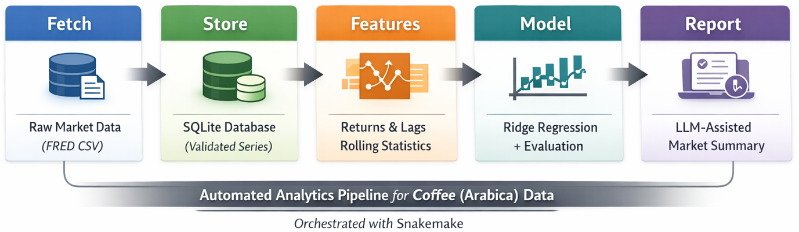

# Coffee Market Analytics (LLM-assisted)

A small, reproducible market time-series analytics pipeline using coffee (Arabica) prices. It fetches public data, stores it in SQLite, generates time-series features, trains a simple baseline model, evaluates performance, and produces a concise analyst-style note using a **local LLM** (Ollama).

The LLM is used for **interpretation and reporting**, not for prediction.


## Outputs

Running the pipeline produces:
- `data/raw/coffee.csv` (ingested series)
- `data/market.db` (SQLite database)
- `data/processed/coffee_features.csv` (engineered features + target)
- `reports/metrics.json` (evaluation metrics)
- `reports/preds.csv` (predictions vs truth on test set)
- `reports/latest_note.md` (LLM-generated analytical note)


## Requirements

- Python 3.9+
- Ollama installed and running locally


## Setup

```bash
python3 -m venv .venv
source .venv/bin/activate
pip install -r requirements.txt
```


## Run the full pipeline

From the project root (with the virtual environment activated):

```bash
snakemake -s workflow/Snakefile --cores 1 --latency-wait 30
```

